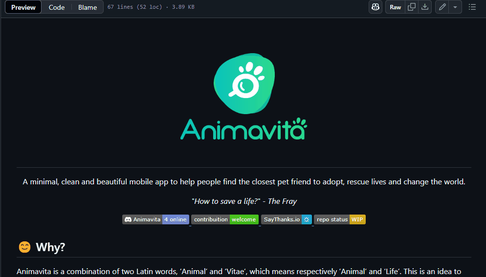

# Aula criando um bom arquivo README
 Modelo de arquivo README 🚀


[](https://github.com/animavita/animavita.git)

## Tecnologias utilizadas
- HTML
- CSS


## Como utilizar JS
Passo 1
```
Faça isso
```

Passo 2
```
Faça isso
```
Passo 3
```
Faça isso
```

### Desafios que tive para realizar o projeto

### Lições que aprendi com esse projeto

